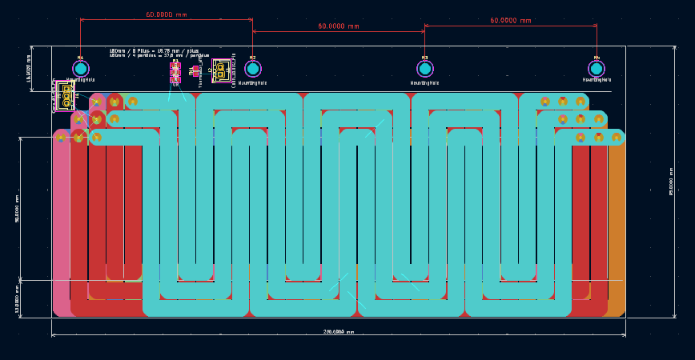
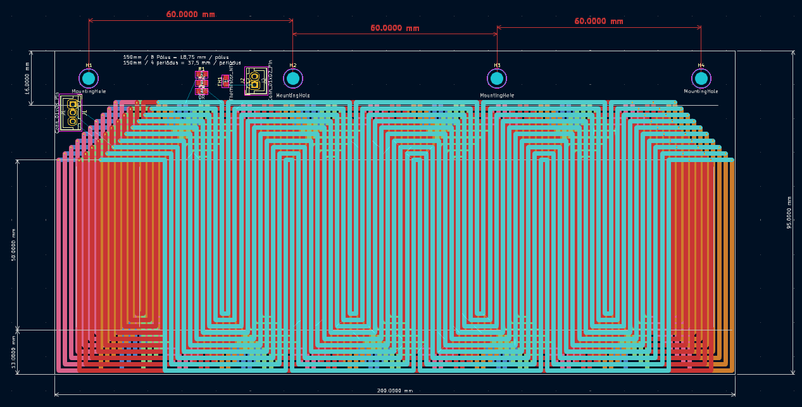

# Advanced-Linear-Motor

An advanced design for linear motors. Uses also some advanced algorithms and Python scripts to optimize the copper usage, resistance, and heat dissipation.

# Design goals

- 6 layer PCBs
- 70µm or 105µm thick copper
- Maximized copper packing for efficiency
- 3 phases
- 1 phase spans 2 layers
- Minimize the number of via

# Adjustable Parameters
The following parameters can be adjusted to customize the design:

- **number_of_tracks_per_pole**: Defines the number of tracks within a single pole.
- **clearance**: Minimum spacing between tracks, in millimeters.

These parameters can be found and adjusted in the `CONFIG` section of the code.

# PCB Parameters

- **pcb_length_mm**: Length of the PCB area dedicated to the tracks (in mm).
- **pcb_height_mm**: Height of the PCB area dedicated to the tracks (in mm).
- **no_of_poles**: Total number of poles in the design.
- **no_of_periods**: Number of repeating periods for the track layout.
- **no_of_phases**: Number of electrical phases (e.g., 3-phase motor).

# Installation

1. Clone the repository:
   ```bash
   git clone <repository-url>
   ```
2. Place the plugin in KiCad's scripting plugins directory:
   - Windows: `%APPDATA%/kicad/scripting/plugins/`
   - Linux: `~/.local/share/kicad/scripting/plugins/`
   - macOS: `~/Library/Application Support/kicad/scripting/plugins/`
3. Restart KiCad to load the plugin.

# Usage

1. Open your PCB project in KiCad.
2. Launch the plugin from **Tools > External Plugins**.
3. Adjust the design parameters as needed:
   - Track width, clearance, via dimensions
   - Number of poles and phases
4. Click **Run Plugin** to generate the layout.

# Examples with Different Parameters

## Example 1: Lower Number of Tracks
This example uses a lower value for `number_of_tracks_per_pole`. The clearance is kept at 0.25 mm.



## Example 2: Higher Number of Tracks
This example increases the `number_of_tracks_per_pole` and the clearance is kept at 0.25 mm.




